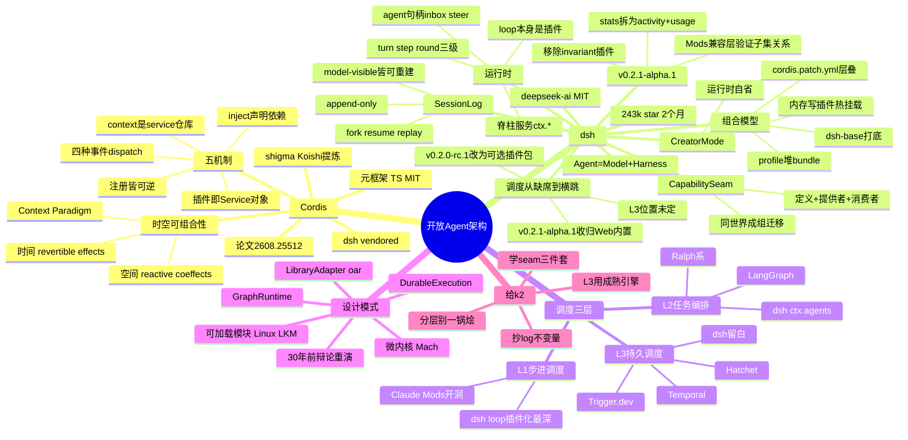

# 开放 Agent 架构调研：Cordis · dsh · Agent 调度

> Agent 系统的竞争已经从"卖 Token"打到运行时层（Model + Harness = Agent）。本报告沿三条线深挖开放架构：**Cordis**（微内核元框架）、**dsh**（DeepSeek Harness，Everything is a Plugin）、以及 **Agent 调度的三层模型**与开源方案横评。

- 调研日期：2026-10-04（当日 15:40 追加 v0.2.1-alpha.1 更新）
- 方法：公开仓库、arXiv 论文、官方文档 + 第三方实测报告（特别感谢 [s2p2/dsh-lab](https://github.com/s2p2/dsh-lab) 的 dsh-baseline，其方法是对照 bundle patch YAML 逐条验证产品页 claim）

---

## 1. Cordis：插件化的形式化理论

> 详细版见 [ringozzt/cordis-research](https://github.com/ringozzt/cordis-research)（2026-10-01）。这里是更新+摘要。

- [cordiverse/cordis](https://github.com/cordiverse/cordis)，TypeScript，MIT，作者 shigma（Koishi.js 作者，论文署名 Yifan Shi，北大 + DeepSeek-AI）。
- 论文 [_A Programming Paradigm for Spatiotemporal Composability_](https://arxiv.org/abs/2608.25512)（arXiv:2608.25512，2026-08-26 提交，92 页，作者 Yifan Shi / Wei Zhang / Tianyi Cui）。
- **注意**：dsh-lab 逐字扫描 92 页 PDF 发现论文全文**未提及 DSH**，"DSH 是论文旗舰应用"只是社区推断，不要当论文 claim 引用。
- 核心理论——**时空可组合性**的两个正交维度：
  - **时间**：`revertible effects`——组件移除时副作用被完全撤销，runtime 代持逆操作；
  - **空间**：`reactive coeffects`——组件声明依赖，context 变化时响应式装配；
  - 统一为 **Context Paradigm**：effect/coeffect 经由单一 context mediation，交错执行互不干扰。
- 工程上最重要的五个机制（dsh-lab 提炼版）：
  1. 插件 = 实现 `Service` 接口的对象；
  2. context = service 的仓库，消费者按 key 解析、绝不直接 import（重复加载直接 throw，fail-loud）；
  3. 依赖经 `inject` 声明，加载顺序从 service 可用性中涌现，而非写死的 boot 顺序；
  4. 类型化事件，四种 dispatch 模式：`emit`（观察）、`waterfall`（洋葱中间件，可短路）、`parallel`、`serial`；
  5. 所有注册都是可逆 effect，`ctx.effect()`/`ctx.on()` 返回 disposer，卸载/HMR 确定性回滚——这就是 "everything is a plugin" 在运行时不散架的原因。
- dsh **vendored**（内置拷贝）Cordis 而非 npm 依赖：dev preview 阶段要频繁魔改。

## 2. dsh 架构深挖（DeepSeek Harness）

- [deepseek-ai/deepseek-harness](https://github.com/deepseek-ai/deepseek-harness)，2026-08-13 创建，MIT，TypeScript monorepo。2026-10-04 实测：~243k star / 29k fork / 20.7k commits / 25 releases。两个月从 0 到 24 万 star——"Harness 之争"的热度本热。
- 口号：**"Everything is a Plugin"** / 中文 "一切皆插件，运行有迹可循"。定位公式：**Agent = Model + Harness**。

### 2.1 组合模型：profile → bundle → patch

- **profile**（`$DSH_HOME/profiles/<name>`）堆叠 **bundle**，bundle = `cordis.patch.yml` 行 + 代码；再叠 home 级 patch 和 `--patch` 参数。patch 按 id 整行替换配置（无深合并）。
- `dsh-base` 是每个 profile 的第 1 层；`dsh-web-app` / `dsh-headless` 是官方模式包。任何新 profile 经 `dsh plugin` 创建。
- 分发：`dsh plugin add <npm包|本地路径|tarball|github:user/pkg#sha>`，生态约定用 `dsh-plugin` GitHub topic 发现。**in-repo 无官方 marketplace**。

### 2.2 运行时：turn / step / round 三级

- **turn** = 一次输入排空；**step** = 一次模型请求 + 工具执行；**round** = 外层策略迭代（goal round / Ralph round）。
- turn 事件流：`turn/start` → claim inbox → `agent/pre-step`（waterfall，可拒绝）→ `step/start` → prompt 组装 → `agent/request` → `llm/stream` → `tool/call*` → `tools/pre-execute` → guards → `tools/execute` → `tools/post-execute` → `step/end` → `turn/end`。
- 脊柱服务：`ctx.sessions`（append-only 存储）、`ctx.systemPrompt`、`ctx.tools`（注册表 + guard 管道）、`ctx.agents`（live Agent 句柄工厂）、`ctx.agentLoop`（唯一的 concrete driver——**但它自己也是 bundle 的一行**，扩展只依赖 `agent` 不依赖 `agent-loop`）、`ctx.llm`。
- Agent 句柄：`inbox`（append/prepend/splice/claim）、`cancel`、`steer`、`inject`、per-agent 的 scoped `ctx`（scoped 注册的工具可 shadow 全局同名项）。

### 2.3 Session log：不变量驱动

- `SessionEventMap`：append-only 事件流。**运行时不变量：model-visible 的一切必须能从 log 重建**（`ctx.invariants` 断言）。
- 历史、UI、telemetry、fork/resume、搜索全部从 log 派生；Trajectory 视图；`llm-replay`。
- 持久化：每次模型请求 flush checkpoint，崩溃恢复时用合成 `turn/end {interrupted}` 闭合孤儿 turn；JSONL + zstd 帧 + checksum。

### 2.4 Capability seam：扩展的强制单位

- 约 50 个 `ctx.*` 服务，每个 seam = **Definition + Provider + Consumer** 三件套（常分属不同包），缺一不可。范例：`dsh-shell`（定义）/ `dsh-bash-local`·`dsh-bash-sandbox`（providers）/ `dsh-tool-bash`（consumer）。
- **同世界 provider 成组迁移**：`ctx.fs` + `ctx.subprocess` 共享同一执行世界，一起指向 E2B 时 Bash、PTY、LSP 全跟着走——换 provider 不动 consumer。
- 动态扩展：Creator 预设的 `tool-cordis` 可在 vm sandbox 里定义/检查/运行模型手写的 Cordis 包（明确是信任边界，不是沙箱）。

### 2.5 四种模式与 Creator Mode

- Standard / Code / Minimal / Creator 是 **agent presets**（`agent.cordis.yml`），不是 profiles。
- Creator = `cordis` preset：运行时自省（看自己挂了哪些插件）、内存里写插件实验、热挂载、持久化成新 preset——"现场改写自身器官"。
- Web UI 本体也是插件（client bundle），host/browser 双半插件模型。

### 2.6 调度在 dsh 里：从缺席到横跳

- 产品页宣称插件涵盖 "models, tools, skills, sessions, sandboxes, storage, loops, **scheduling**, and the UI"——dsh-lab（2026-08-30）验证：**schedule 包存在，但是 opt-in，没有任何官方 bundle 挂载它**。"absence is data"。
- **2026-10-03 更新**：v0.2.0-rc.1 把自动化任务"改由可选插件包提供"；v0.2.1-alpha.1 又"改为 Web 内置能力"——提醒工具按模式提供（Standard/Creator/PTC 可用，Minimal/子代理不可用），旧任务保留。L3 在"插件 vs 内置"之间横跳，说明团队自己也在找调度该住哪一层。
- session event 里有 `schedule/change` 类型，subagent scheduling 进 log。

### 2.7 v0.2.1-alpha.1：Mods 兼容层与破坏性变更（2026-10-03）

- **实验性 Claude Code Mods 兼容层**（[@tianyicui](https://github.com/deepseek-ai/deepseek-harness/releases) 亲自挂名）：目标**不是**完整兼容，而是**验证 Claude Code Mods API 的功能大致为 dsh 插件能力的一个子集**——与其说是兼容层，不如说是收编声明：你的 API 表达能力 ⊆ 我的插件系统。
- **破坏性变更**：移除运行时 invariant 插件及各包 `./invariant` 导出（本报告 §2.3 的"运行时不变量"正是它，依赖诊断入口的扩展和自定义 profile 需迁移）；输入区 `stats` 扩展点拆为 `activity` + `usage`。dev preview 的 breaking 警告是玩真的——dsh 的插件契约目前是流沙。

## 3. Agent 调度的三层模型

把"调度"拆成三层，每层解决不同的问题：

| 层 | 问题 | dsh 的做法 | 其他代表 |
|---|---|---|---|
| **L1 步进调度** | 这一步怎么走（turn/step/round） | agent loop 本身是插件，可换 | Claude Code 内置 loop + Mods 开洞 |
| **L2 任务编排** | 任务怎么拆（subagents/workflows/DAG） | `ctx.agents` 句柄（inbox/steer/inject）+ scoped ctx | LangGraph、Ralph 系 |
| **L3 持久调度** | 挂了怎么恢复（cron/定时/跨机） | schedule 插件占位，未挂载 | Temporal、Hatchet、Trigger.dev |

关键洞察：**dsh 在 L1 最深（连 loop 都能换），L3 最浅（故意留白）**；Temporal 在 L3 最深，L1 完全不碰。三层正交，一个 harness 不必全做——dsh 把 L3 留给生态，Temporal 把 L1 留给用户代码。

## 4. 开源调度 / 编排方案横评

| 方案 | 定位 | 许可/语言 | 调度相关特性 | 一句话 |
|---|---|---|---|---|
| [Temporal](https://temporal.io) | durable workflow as code | Server MIT / Go | signals/updates/queries，可暂停 60 天等待；Nexus 跨 namespace | L3 的事实标准；AgentWorkflow 模式（tool = Activity wrapper） |
| [Hatchet](https://github.com/hatchet-dev/hatchet) | Postgres-backed 编排引擎 | MIT / Go+TS/Python SDK | DAG first-class，7.9k star，明确写着 "for AI agents" | 不想运新 datastore 的选它（已有 Postgres 直接起） |
| Trigger.dev | task-based 后台任务 | Apache 2.0 | Docker Compose 自托管 | 后台任务的老实选择 |
| Inngest | step functions | SSPL（3 年后转 Apache 2.0）| serverless/HTTP | 许可上不如前两者开放 |
| Restate / DBOS | durable execution | 开源 | OpenAI Agents SDK 官方列出的 durable 集成 | 轻量 durable execution 二选 |
| [LangGraph](https://github.com/langchain-ai/langgraph) | graph runtime | MIT / Python+TS | `interrupt()` 无限暂停，subgraphs（同进程） | L2 编排的 AI-first 选择；跨进程是短板 |
| Microsoft Agent Framework | agent 框架 | OSS | checkpoint + **time-travel**，A2A native | AutoGen 后继，微软系 |
| Ralph 系（ralph-orchestrator/ralphex/toryo/ordewell） | loop-until-done 编排 | 各异 | 鲜 session per task、质量棘轮、自动 commit | 轻量 L2，个人/小团队够用 |
| [AgenticTime](https://github.com/agentralabs/agentic-time) | agent 调度专用二进制时间格式 | MIT/Apache-2.0 / Rust | PERT 估计、Ebbinghaus 衰减、Allen 冲突检测，42 tests | 有意思的新物种：把"时间"本身做成可移植格式 |

## 5. 设计模式对照

| 模式 | 代表 | 开放点 | 代价 |
|---|---|---|---|
| Microkernel + 可逆 effects | Cordis / dsh | 一切皆可换，连 loop 和 UI 都行 | 复杂度税、插件版本矩阵、跨插件调试地狱 |
| Durable execution / event sourcing | Temporal、dsh session log | 时间可回放、可恢复 | L1 不碰；重 |
| Graph runtime | LangGraph | 声明式编排 | 同进程、单语言 |
| Middleware chain（洋葱） | Claude Mods | 单体内核 + 可加载模块 | 宿主说了算，能开什么洞由 Anthropic 定 |
| Library / adapter | oar | 跨 harness 可移植 | 最大公约数，深能力表达不出 |
| Cron-as-plugin → 内置横跳 | dsh schedule/automation | 调度在插件与内置间横跳 | v0.2.1-alpha.1 收归 Web 内置 |

历史押韵：dsh 是微内核原教旨（Mach），Claude Mods 是单体内核加可加载模块（Linux LKM）——in-process、有特权、可热加载。30 年前 Tanenbaum–Torvalds 打过一次，赢的是 Linux。微内核在 adoption 上从来打不过"务实的单体 + hooks"。

## 6. 结论：给 k2 的参考

1. **调度分层，别一锅烩**：k2 的 daemon 可以在 L1 借 Cordis 思想（loop/工具链插件化），L3 直接用 Temporal/Hatchet 这类成熟引擎，别自己造 cron。
2. **revertible effects**：插件卸载的资源清理不应靠自觉，而应由 runtime 持有逆操作——指导 k2 插件生命周期的 teardown 设计。
3. **capability seam 三件套**：k2-bridge 的协议适配（Codex/Claude/ACP）可以学 Definition/Provider/Consumer 分离——换 provider 不动 consumer。
4. **session log 不变量**（model-visible means logged）：可观测、回放、审计的地基，k2 的 daemon 层值得抄。
5. **dsh schedule 从缺席到横跳**（可选插件包 → v0.2.1-alpha.1 收归 Web 内置）：L3 连 DeepSeek 都在找位置，说明"调度"和"harness"是两门手艺；k2 不必在 daemon 里做重调度，薄薄一层对接外部引擎即可，静观其变。

## 7. 思维导图



## 引用

```bibtex
@misc{shi2026programming,
  title={A Programming Paradigm for Spatiotemporal Composability},
  author={Yifan Shi and Wei Zhang and Tianyi Cui},
  year={2026}, eprint={2608.25512}, archivePrefix={arXiv}, primaryClass={cs.PL},
  url={https://arxiv.org/abs/2608.25512}
}
@misc{deepseek-harness2026,
  title={DeepSeek Harness: Everything is a Plugin},
  author={DeepSeek-AI}, year={2026}, publisher={GitHub},
  howpublished={\url{https://github.com/deepseek-ai/deepseek-harness}}
}
```

- dsh 实测数据来源：[s2p2/dsh-lab](https://github.com/s2p2/dsh-lab/blob/HEAD/docs/research/harness-map/dsh-baseline.md)（2026-08-30，逐 bundle patch 验证）
- Cordis 详解：[ringozzt/cordis-research](https://github.com/ringozzt/cordis-research)
- oar 对照：[ringozzt/oar-research](https://github.com/ringozzt/oar-research)
